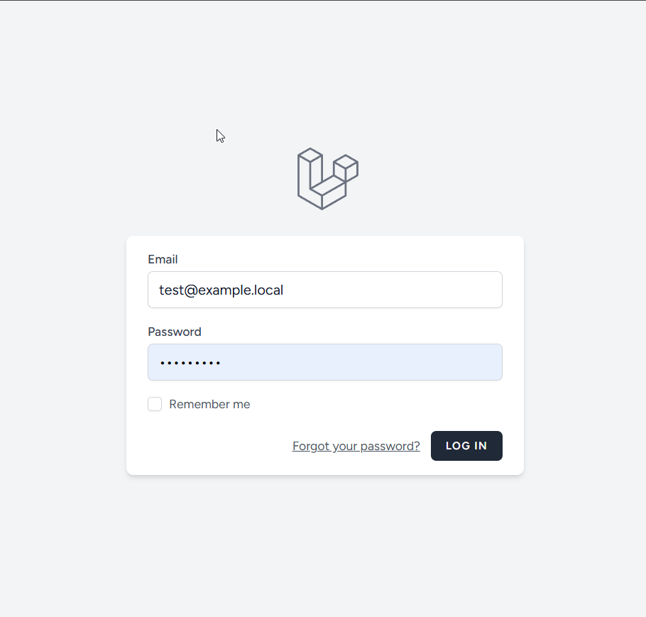
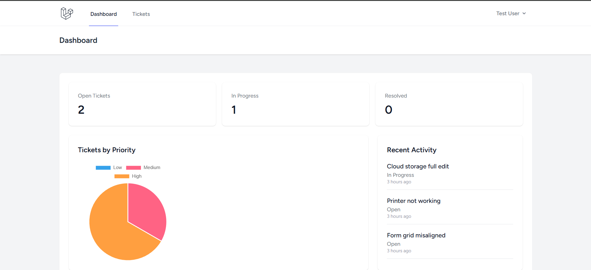
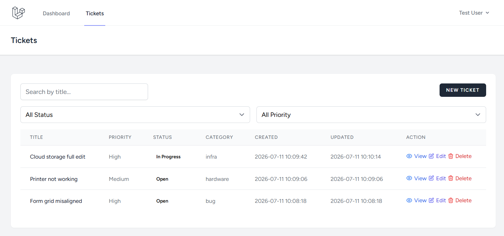
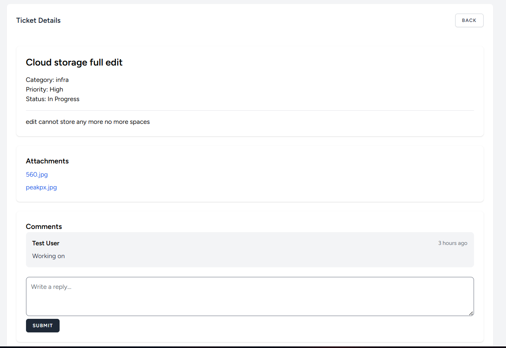

# Setup Commands
```
git clone https://github.com/wsayub98/helpdesk-assessment.git
cd helpdesk-assessment
cp .env.example .env
composer install
php artisan key:generate
php artisan migrate --seed
npm install && npm run build
php artisan serve
# Visit http://localhost:8000
```
### Use below credential to login. Or register new user.
```
email: test@example.local
password: H3lpd3sk
```





